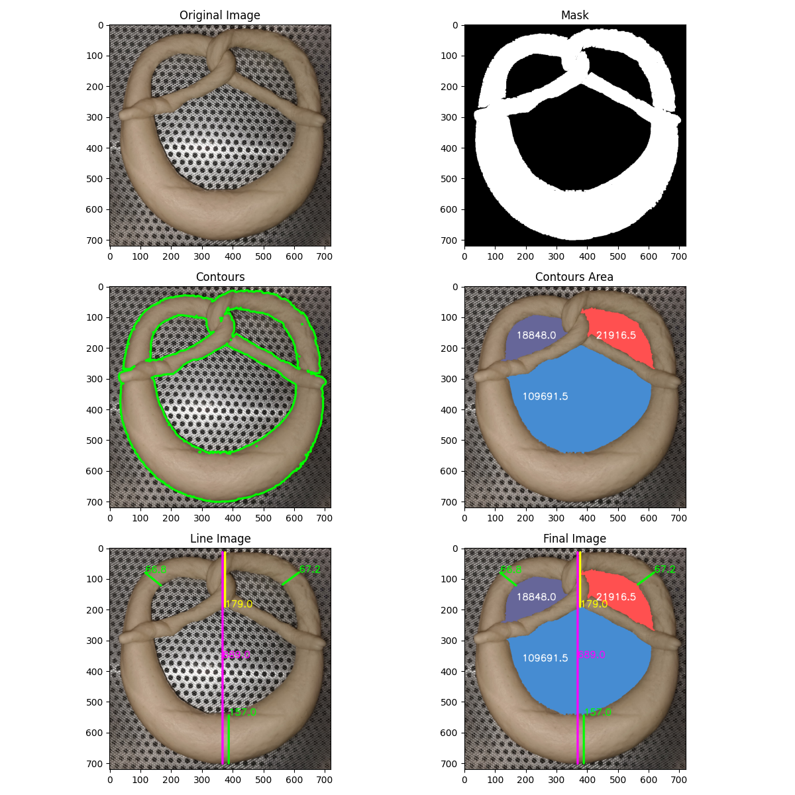
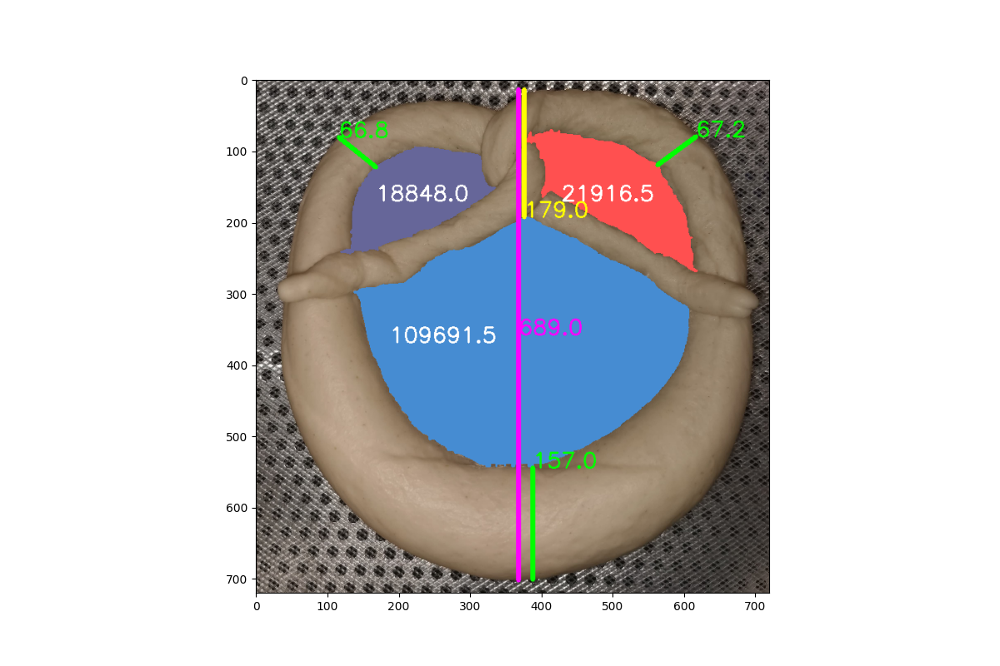

# Pretzel Shape Quality Control Using OpenCV

This project implements an automated quality control system for pretzel production using image processing techniques. The system is designed to analyze the shape and dimensions of pretzels on a production line, ensuring they meet specified standards before packaging.

## Project Overview

The primary purpose of this project is to:

- Automate the quality control process in pretzel production.
- Ensure consistency in pretzel shape and size.
- Identify pretzels that do not meet the required standards.
- Increase efficiency and reduce human error in the quality control process.

The system setup for this project is:

- A fixed camera is mounted above a conveyor belt where pretzels pass through.
- The fixed camera position allows for consistent imaging conditions, simplifying the thresholding process.
- Pretzels move along the conveyor belt, and images are captured at regular intervals.

## Features

- Image preprocessing (cropping, resizing, color space conversion)
- HSV-based color masking
- Contour detection and filtering
- Area calculation for detected regions
- Height and width measurements of specific features
- Visualization of detected features and measurements

## Dependencies

The project requires the following Python libraries:

- OpenCV (cv2)
- NumPy
- Matplotlib
- Pandas

You can install these dependencies using pip:

```
pip install opencv-python pandas numpy matplotlib
```

## Pipeline Stages

1. Load and preprocess image
2. Convert image to HSV color space
3. Create mask based on HSV range
4. Find and filter contours
5. Identify specific regions (e.g, pretzel loops)
6. Detect and draw specific measurement lines (e.g, pretzel loop heights)
7. Display final image with contours and measurements

Following is a sample output of the pipeline on a example image:


## Final Output

The final output image shows all the areas and measurements detected by the system. This information can be used to determine whether the pretzel meets the required standards or needs to be rejected. Additionally, it can be easily further integrated with a system to automatically discard or remove such pretzels.

An example of the final output image is shown below:
